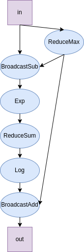

# argmin_argmax OP性能优化设计文档

| 基本信息                                                     | 内容                                      |
| ------------------------------------------------------------ | ----------------------------------------- |
| 提交作者<input type="checkbox" class="rowselector hidden">   | Asthestarsfalll                           |
| 提交时间<input type="checkbox" class="rowselector hidden">   | 2023-03-05                                |
| 版本号                                                       | V1.0                                      |
| 依赖飞桨版本<input type="checkbox" class="rowselector hidden"> | develop                                   |
| 文件名                                                       | 20220305_logsumexp_op_optimization.md  |

# 1 背景与意义

## 1.1 飞桨现状

目前 Paddle 内 logsumexp OP 的 GPU 计算调用了 eigen，性能较差，有较大的提升空间。

## 1.2 业内方案调研

### 1.2.1 PyTorch

PyTorch中使用了cutlass实现，代码见[此](https://github.com/pytorch/pytorch/blob/43e71cddb0dc85b43a98238740bd5f8584d841fd/aten/src/ATen/native/transformers/cuda/mem_eff_attention/epilogue_thread_apply_logsumexp.h#L108)

### 1.2.2 OneFlow

OneFlow中使用了ReduceKernel+ElementwiseKernel组合的方式，代码见[此](https://github.com/Oneflow-Inc/oneflow/blob/1979b9eb1f302f22b882f1c78ba6ce93e9cc2c91/oneflow/core/functional/impl/math_functor.cpp#L982-L1003)

## 1.3 对比分析

二者与paddle中实现思路基本一致，值得一提的是OneFlow的实现方式中有对输入数据含Inf的处理。

# 2 设计方案与性能预期

## 2.1算子分析

logsumexp计算公式如下：
$$
logsumexp = \log\sum_{i=1}^N e^{x_i} \tag{1}
$$
为了解决输入数据中某些数据过大或过小计算指数造成的上溢和下溢的问题，可以将上述公式(1)等价转换为：
$$
\begin{equation} 
\begin{aligned}
logsumexp &=\log\sum_{i=1}^N e^{x_i} \\
&=\log\sum_{i=1}^N e^{x_i-m}e^m\\
&=\log e^m\sum_{i=1}^N e^{x_i-m}\\
&=\log\sum_{i=1}^N e^{x_i-m} + \log e^m\\
&=\log\sum_{i=1}^N e^{x_i-m} + m
\end{aligned}
\end{equation}
$$
其中m一般取输入数据中最大的数。

logsumexp的计算图如下:

由于logsumexp与softmax类似，可以参考softmax，转换其输入为(num_rows, num_cols)。

## 2.1 关键模块与性能提升点

具体实现方式上，可以借助shared memory合并带有Reduce计算的Kernel，以减少访问global memory的次数。fusion后的logsumexp Kernel会在一开始把输入加载到shared memory中，每个block的shared memory加载一个instance的feature，shape为`(1, c)`。后续的所有中间计算结果都保存到shared memory中，只将最后的输出out写到global memory里。

需要注意的是，这种fusion仅在c在一个适当的范围里才能使用，过小会浪费block的thread资源，过大会由于shared memory资源不够，导致Kernel启动失败。

性能预期提升为原算子的10倍以上。

## 2.2 Host端计算流程

将输入按照softmax的方式转换为二维(num_rows, num_cols)。

## 2.4 Device端计算流程

由于num_cols的变化会有效带宽和性能造成影响，可以采取分段优化的方式：

1. $num\_cols<=1024$时，一个warp处理一行的计算
2. $1024 < num\_cols<=N$时，一个block处理一行的计算，同时使用shared memory保存中间结果，$N$为shared memory可启动情况下的最大值。
3. 当$num\_cols>N$时，不再使用shared memory，可以使用paddle内置的reduce function和elmentwise function。

# 3 测试和验收的考量

参考：[算子性能优化验收标准](http://agroup.baidu.com/paddle-perf/md/article/4892913)

# 4 可行性分析和排期规划

时间和开发排期规划，主要milestone

| No.  | 开发内容                                       | 预期时间       |
| ---- | ---------------------------------------------- | -------------- |
| 1    | 理清Paddle中OP设计思路，同类产品中最佳设计方案 | 3-05--3-12     |
| 2    | 完成代码开发工作，通过CI                       | 3-12--3-28     |
| 3    | 提交PR进行后续迭代                             | 3-28--活动结束 |

# 5 影响面

待优化的算子独立运行，不涉及其他算子和模块的修改，API设计与之前保持一致。

# 名词解释

# 附件及参考资料

[1]. [OP Benchmark使用指南](https://github.com/PaddlePaddle/benchmark/blob/master/api/README.md)

[2]. https://zhuanlan.zhihu.com/p/341059988
